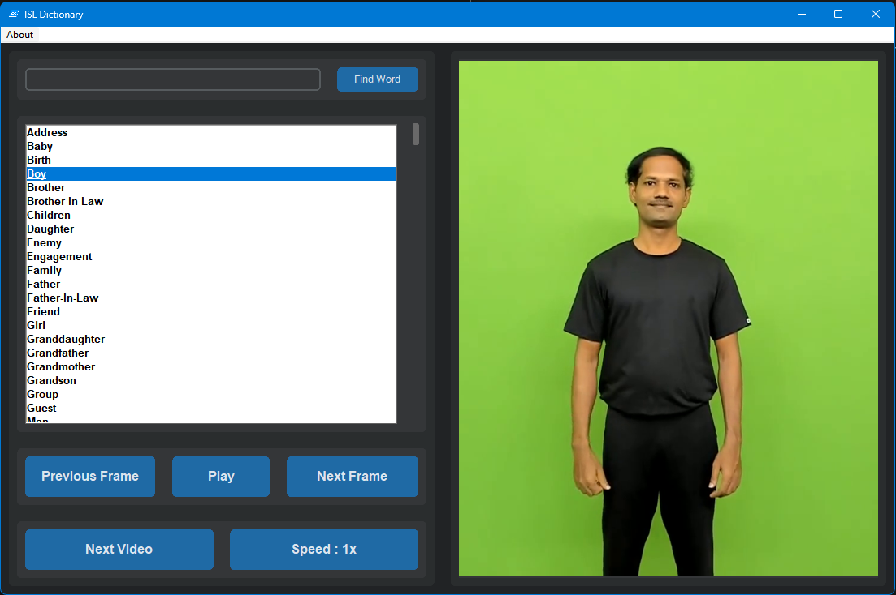

# Sign Language Dictionary Application

Welcome to the Sign Language (SL) Dictionary Application! This project aims to provide a comprehensive dictionary of Sign Language, enabling users to learn and reference SL easily. This README file will guide you through the features, installation and usage for the application.



**Web version of this application is available [Here](cs.rkmvu.ac.in/~isl).**

## Table of Contents
- [Features](#features)
- [Installation](#installation)
- [Usage](#usage)
- [License](#license)
- [Acknowledgements](#acknowledgements)

## Features

- **SL Dictionary**: Access words and their corresponding signs in Sign Language.
- **Video Demonstrations**: View video demonstrations of each sign for better understanding and learning.
- **Search Functionality**: Quickly find specific signs using the search feature which allows prefix search also.
- **Speed and Frame Check**: See sign videos in different speed and have feature to check frame by frame.
- **User-Friendly Interface**: Simple and intuitive interface for ease of use.

## Installation

To run the SL Dictionary Application locally, follow these steps:

1. **Clone the Repository**:
    ```bash
    git clone https://github.com/suvajit-patra/sl-dictionary-app.git
    cd sl-dictionary-app
    ```

2. **Install Dependencies**:
    Make sure you have `tkinter` installed with the following libraries installed:
    ```
    opencv-python==4.6.0.66
    imageio==2.22.2
    customtkinter==4.6.3
    ```

3. **Download Data**:
    Download the Indian sign language data from [here](https://drive.google.com/file/d/1LERX4tOWdBjIRuEV-XJOTeX2EyPDBQFG/view?usp=sharing) and put the `videos` and `words.txt` in the `data` folder.

4. **Start the Application**:
    ```
    python dictionary_main.py
    ```

## Usage

Once the application is running, you can:

- **Search for Signs**: Use the search box to find signs for specific words.
- **Watch Videos**: Click on words to watch video demonstrations of the signs.
- **Learn**: Use the application as a learning tool to improve your understanding and fluency in Sign Language.

## License

This project is licensed under the MIT License. See the [LICENSE](LICENSE) file for details.

## Acknowledgements

We would like to thank the FDMSE, RKMVERI for their valuable resources and support.


---

For any questions or support, please open an issue in this repository.

Happy Learning!

---
